### Hello, super, how's it goin', ladies! 👋

🤔 My name is Mr. Eud-- I mean-- ez500, and that's my name because they are my initials plus my favorite number plus two zeroes.

 

💬 Some languages I can (maybe) code in are Python, Java, C/C++, HTML/CSS/JS, Ruby

📫 Discord: bigfatmidget  
⚡ Please visit and follow my [Twitch](https://twitch.tv/bigfatmidget) lol

🔧 I am currently working on a CRM project, a food formulation simulator and food-science-specialized agent (private repos), and maintaining a friend's Minecraft plugin with source on [GitHub](https://github.com/greatericontop/weaponmaster).

<!--
**ez500/ez500** is a ✨ _special_ ✨ repository because its `README.md` (this file) appears on your GitHub profile.

Here are some ideas to get you started:

- 🔭 I’m currently working on ...
- 🌱 I’m currently learning ...
- 👯 I’m looking to collaborate on ...
- 🤔 I’m looking for help with ...
- 💬 Ask me about ...
- 📫 How to reach me: ...
- 😄 Pronouns: ...
- ⚡ Fun fact: ...
-->
